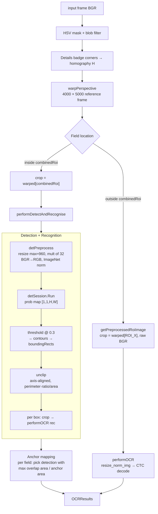

# PaddleOCR Migration: Per-ROI → Detection+Recognition

## Context

The OCR pipeline started life on Tesseract with a per-field crop strategy: 11 hand-picked rectangles in a 4000×5000 warped reference frame, each cropped from the input and fed individually to the recogniser. After moving the recogniser to PaddleOCR (`ppocr_mobile_rec.onnx`, ONNX Runtime), accuracy regressed below the Tesseract baseline. Stylised UI elements like the "Details" badge were returning empty strings; small digits like a single "0" were hallucinating into "000022".

This doc captures how the pipeline ended up at PP-OCR detection over a single combined ROI, with per-field anchor mapping for the score-panel fields and a recogniser-only fallback for everything outside that region.

---

## Diagnosis

The recognition failures had a single root cause: **the preprocessing pipeline was carry-over from the Tesseract era**, and it produced images far outside PP-OCRv5's training distribution.

Per-ROI preprocessing did:
1. `cvtColor(BGR2GRAY)` — drop colour
2. `morphologyEx(MORPH_TOPHAT)` — distort strokes correcting uneven illumination
3. `resize(×3 INTER_CUBIC)` — upscale
4. `GaussianBlur` — denoise
5. `threshold(BINARY_INV | OTSU)` — binarize to white-on-black
6. `cvtColor(GRAY2BGR)` — fake BGR back for `performOCR`

Cross-referencing PaddleOCR's official `tools/infer/predict_rec.py::resize_norm_img` showed PP-OCRv5 expects:
- BGR uint8, 3-channel
- Natural color/grayscale gradients with anti-aliased edges
- Dark text on light background (training distribution polarity)
- Aspect-preserving resize to height 48, max width 320
- Simple `(x/255 − 0.5)/0.5` normalisation (NOT ImageNet mean/std)

The Tesseract-era pipeline removed every signal the recogniser was trained to use — colour, edges, gradient — then inverted polarity on top.

---

## Migration: Three Layered Fixes

### Fix 1 — Strip the Tesseract-era preprocessing

[native_opencv/ios/Classes/ddrocr_instance.cpp](../native_opencv/ios/Classes/ddrocr_instance.cpp) `getPreprocessedRoiImage` was rewritten to pass the raw warped BGR crop straight to `performOCR`. ~30 lines of binarization removed, ~10 added.

Result: title, username, difficulty, details started producing non-empty text. But small digit ROIs (single "0", "4") sometimes produced spurious extra digits ("000022").

### Fix 2 — Horizontal padding for digit ROIs

Tight single-character crops triggered CTC repeat-emission. Bumped `expand_x` to 20 px for every digit field in [lib/ocr_config.dart](../lib/ocr_config.dart) — `score`, `marvelous`, `perfect`, `great`, `good`, `miss`, `max_combo`. Gave the recogniser a strip of background flanking each digit, matching the training distribution where text fills 60–90% (not 100%) of the frame.

### Fix 3 — Detection + recognition for the score panel

Even with padding, hand-picked rectangles couldn't produce model-aligned tight crops. We layered in PP-OCR's detection model (DBNet, `ppocr_mobile_det.onnx`) over a single combined ROI covering the whole score panel — `TL: (1648, 2439)` → `BR: (2959, 2848)` in warped space. The detector finds text boxes; recognition runs on each, and each detection is mapped to a per-field role via the existing `ocrRoi` rectangles acting as spatial anchors.

Fields outside the combined ROI (title, username, difficulty, details) stay on the per-ROI recogniser-only path from Fix 1.

---

## Architecture Today

### Coordinate spaces
- **Original-frame**: pixels in the input image (camera frame / picked image).
- **Warped**: 4000×5000 reference frame produced by perspective homography `H`, anchored to the "Details" badge corners. All `ocrRoi` constants live here.
- **Combined-crop**: subregion of the warped frame fed to the detector. Detection box coords are local to this crop.

### Pipeline



### Recognition input (canonical PP-OCRv5)
[native_opencv/ios/Classes/ocr_onnx.cpp](../native_opencv/ios/Classes/ocr_onnx.cpp) `performOCR`:
- BGR uint8 input
- Resize: height 48, aspect preserved, width ≤ 320 (`INTER_LINEAR`)
- Norm: `(x/255 − 0.5)/0.5` → `[−1, 1]`
- Right-pad to 320 with `-1.0` (post-norm equivalent of black)
- ONNX session: input `x`, output `fetch_name_0`
- CTC greedy decode + per-character softmax confidence

### Detection (added)
[native_opencv/ios/Classes/ocr_onnx.cpp](../native_opencv/ios/Classes/ocr_onnx.cpp) `performDetectAndRecognise`:
- BGR uint8 input
- Resize so max side ≈ 960, both dims multiples of 32
- BGR → RGB, ImageNet mean/std normalisation (`mean=[0.485,0.456,0.406]`, `std=[0.229,0.224,0.225]`)
- ONNX session (PIR-format export): input `x`, output `fetch_name_0`, shape `[1,1,H,W]`
- DB postprocess: threshold @ 0.3, contours, axis-aligned bounding rects, unclip expansion (ratio 1.6, area/perimeter heuristic)
- Returns `std::vector<DetectedText>` with box (in input coords) + recognised text

### Per-field anchor mapping
[native_opencv/ios/Classes/ddrocr_instance.cpp](../native_opencv/ios/Classes/ddrocr_instance.cpp):
```
auto pickBestDetection = [&](const cv::Rect &fieldRoi) -> OCRResult {
    cv::Rect anchor = fieldInCombinedCrop(fieldRoi);
    if (anchor outside combined ROI) return empty;   // title/username fall here
    pick detection with max (inter.area() / anchor.area());
    ties broken by confidence;
}
```

`ocrRoi[]` no longer drives the crop for score-panel fields — only its role label. The detector decides the actual bounding box.

---

## FFI Plumbing Added

### Config (`COCRConfig`)
- `int32_t combinedRoi[4]` at end of struct
- Dart `@Array(4) external Array<Int32> combinedRoi;` in `COCRConfig extends Struct`
- Marshalled from `ocrCombinedRoi` constant in `_buildOCRConfig`

### Optional det model load
[ocr_onnx.cpp](../native_opencv/ios/Classes/ocr_onnx.cpp) — `detSession` load is wrapped in try/catch; missing det model logs `det model unavailable` and `performDetectAndRecognise` returns empty (caller could fall back, currently treated as "no detections in combined ROI").

### Asset copy
[lib/ocr_processor.dart](../lib/ocr_processor.dart) `loadModels` includes `ppocr_mobile_det.onnx` with try/catch — missing det asset logs and skips, doesn't crash startup.

---

## Det Model Provenance

Source: [PaddlePaddle/PP-OCRv5_mobile_det on HuggingFace](https://huggingface.co/PaddlePaddle/PP-OCRv5_mobile_det)

Conversion (PIR format — note `inference.json` not `inference.pdmodel`):
```bash
paddle2onnx --model_dir ./PP-OCRv5_mobile_det \
  --model_filename inference.json \
  --params_filename inference.pdiparams \
  --save_file ppocr_mobile_det.onnx \
  --opset_version 11 \
  --enable_onnx_checker True
```

Output: 4.77 MB ONNX, input `x` shape `[N,3,H,W]`, output `fetch_name_0` shape `[N,1,H,W]`. Constant-folding optimization fails without `onnx_graphsurgeon` but is not required for inference.

Drop at `assets/models/ppocr_mobile_det.onnx`. `pubspec.yaml` already globs `assets/models/`, no manifest edit needed.

---

## Files Touched

| File | Role |
|---|---|
| [lib/ocr_config.dart](../lib/ocr_config.dart) | `ocrCombinedRoi` constant; widened `expand_x` for digit ROIs |
| [lib/ocr_processor.dart](../lib/ocr_processor.dart) | `combinedRoi` FFI struct field + marshalling; det model in `loadModels` |
| [native_opencv/ios/Classes/ddrocr_instance.h](../native_opencv/ios/Classes/ddrocr_instance.h) | `COCRConfig::combinedRoi[4]`; `DetectionInfo` struct; `ProcessImgResult::detections` |
| [native_opencv/ios/Classes/ddrocr_instance.cpp](../native_opencv/ios/Classes/ddrocr_instance.cpp) | Stripped Tesseract-era preprocess; combined-ROI det+rec call site; anchor mapping; H⁻¹ box translation back to original frame |
| [native_opencv/ios/Classes/ocr_wrapper.h](../native_opencv/ios/Classes/ocr_wrapper.h) | `DetectedText` struct; `performDetectAndRecognise` declaration; `detSession` member |
| [native_opencv/ios/Classes/ocr_onnx.cpp](../native_opencv/ios/Classes/ocr_onnx.cpp) | Optional det session load; DBNet preprocess; DB postprocess (threshold/contours/unclip); `performDetectAndRecognise` |

---

## What Was Considered and Rejected

### "Just flip polarity (BINARY → BINARY_INV)"
Considered as a one-character fix. Rejected: binarization itself — not the polarity — destroys the anti-aliased edges and gradient information PP-OCRv5's early conv filters depend on. Flipping which two values they end up at doesn't restore the lost signal. The "skip preprocessing entirely" path was the same edit cost with strictly higher upside.

### "Combined ROI det+rec instead of preprocessing fix"
Considered first. Rejected: the original combined-ROI plan didn't address accuracy — it changed *where* crops come from but still routed them through broken preprocessing. The detector itself would also have failed on binarized input. Preprocessing had to be fixed first; det+rec was layered on top once the recogniser path was working.

### "Expand combined ROI to cover all 11 fields"
Considered when the user-specified combined ROI was found to only cover the score panel. Rejected in favour of hybrid: det+rec inside the combined ROI, per-ROI recogniser-only fallback outside. Smaller code change, same accuracy ceiling for in-scope fields.

### "Replace per-ROI loop entirely with det+rec"
Considered, decided yes for score-panel fields but kept per-ROI fallback for title/username/difficulty/details since the combined ROI doesn't cover them.

---

## Logging Added

Every layer logs verbosely so we can trace any future regression by reading stdout:

- `OCRWrapper: rec ONNX session loaded from ...`
- `OCRWrapper: det ONNX session loaded from ...` (or `det model unavailable`)
- `[DET] combined ROI: warped=(x,y wxh), crop=WxH`
- `[DET][combined] N boxes detected (det=WxH, region=WxH)`
- `[DET][i] text='...' conf=X% crop=(...) warped=(...) orig=(...)` per detection
- `[OCR][name] RESULT: text='...' conf=X% type=Digit size=WxH` per recognition
- `[TIMER] combined detect+rec: N ms, M boxes`
- `[TIMER] [name] performOCR: N ms`
- `[TIMER] process_image total: N ms`
