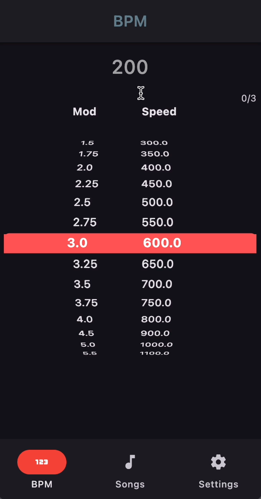
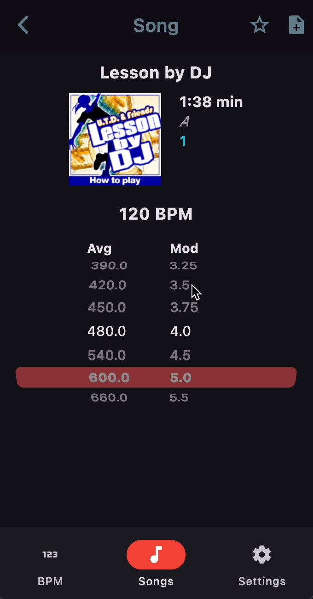
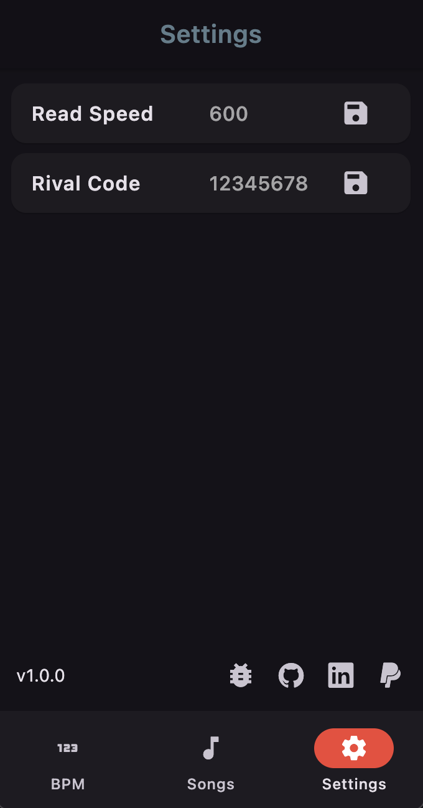
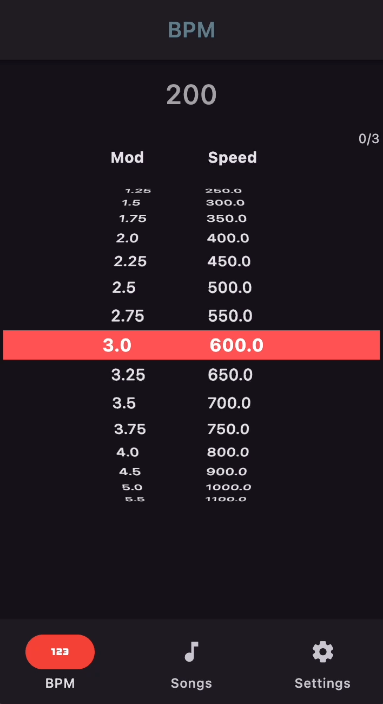

# Release 1
## Usage
This first release was modelled around usage alongside the **DDR Ace** line of DDR cabinets (Ace to A3) as the BPM read speed calculations were not displayed on the screen in this line of games. As such, when playing future versions of the game such as DDR World, this application may not be as useful to you. 

### BPM Wheel
This **BPM Wheel** is intended for use while playing the game so that you know what read speed you will be playing at relative to the modifier that you pick in-game. The read speed that is highlighted is dependent on what you've chosen in the **Settings Page**

The **BPM Wheel** has two main use-cases:
1. ***Ad-hoc usage*** for when there's no time or reason to browse the song list. 
2. Usage ***per-song*** for when there are differences in BPM throughout the song.

|  |  |  |
| --------------------------------------------------------------- | --------------------------- | ------------------------------------------- |
### Song List
The **Song List Page** is a difficulty-sorted and searchable song list for all DDR songs up to DDR A3. This page also allows you to switch between the single and doubles modes to get accurate difficulties for each mode. 

The intended usage of this page is for when you want to check up on song-specific information like BPM switches or the notes that you have written for that song in particular. 

### Settings
On the settings screen, you can set your default **Read Speed** which will affect the other screens in the app, snapping the BPM wheel on the **BPM Page** as well as the **Song Page** to your set read speed.

### Song Page
Checking the song page is most relevant when your chosen song has BPM changes, with DDR MD displaying the maximum, minimum and average BPM across the song alongside a visualisation of the varying BPM and stops throughout the song. 

#### Note-taking
On a per song basis, you're able to take notes that mark the date that you created/updated them, this feature is intended for usage in post-play as a reminder for yourself of any particular trip-ups in the chart. 

#### Favourites
You can favourite your songs and they will show up in their own folder on the **Song List** screen. 

Note-taking and favourites are both saved to your phone's local storage so even if you delete the app and re-install your data will be waiting there for you. 